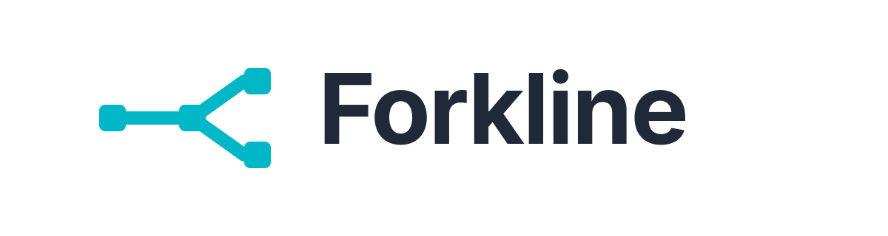

<p align="center">
  
</p>

**Forkline** is a **local-first, replay-first tracing and diffing library for agentic AI workflows**.

Its purpose is simple and strict:

> **Make agent runs reproducible, inspectable, and diffable.**

Forkline treats nondeterminism as something to be **controlled**, not merely observed.

<p align="center">
  
</p>

---

## Why Forkline exists

Modern agentic systems fail in a frustrating way:

- The same prompt behaves differently on different days
- Tool calls change silently
- Debugging becomes guesswork
- CI becomes flaky or meaningless

Logs and dashboards tell you *that* something changed.  
Forkline is built to tell you **where**, **when**, and **why**.

---

## What Forkline does

Forkline allows you to:

- **Record** an agent run as a deterministic, local artifact
- **Replay** that run without re-invoking the LLM ✅
- **Diff** two runs and detect the **first point of divergence** ✅
- **Capture tool calls** safely with deterministic redaction
- **Use agent workflows in CI** without network calls or flakiness

This turns agent behavior into something you can reason about like code.

---

## Replay (Deterministic)

Replay in Forkline means:

- **Offline execution** — No network calls, no LLM invocations during replay
- **Artifact injection** — Tool and LLM outputs come from recorded artifacts, not live calls
- **First-divergence detection** — Comparison halts at the first observable difference
- **Read-only** — Replay never mutates the original recording
- **Deterministic** — Same inputs always produce identical comparison results

```python
from forkline import SQLiteStore, ReplayEngine, ReplayStatus

store = SQLiteStore()
engine = ReplayEngine(store)

# Record a run (see docs/RECORDING_V0.md)
# ...

# Compare two recorded runs
result = engine.compare_runs("baseline-run", "current-run")

if result.status == ReplayStatus.MATCH:
    print("Runs are identical")
elif result.status == ReplayStatus.DIVERGED:
    print(f"Diverged at step {result.divergence.step_idx}: {result.divergence.divergence_type}")
```

See [`docs/REPLAY_ENGINE_V0.md`](docs/REPLAY_ENGINE_V0.md) for full replay documentation.

---

## Quick Start

```bash
# Install (editable)
pip install -e .

# Run a script under forkline tracing
forkline run examples/minimal.py

# List recorded runs
forkline list

# Replay a run (prints summary)
forkline replay <run_id>

# Diff two runs
forkline diff <run_id_a> <run_id_b>
```

### CLI Reference

```bash
# Run a script and capture metadata (timestamps, exit code, script path)
forkline run examples/minimal.py
# => run_id: 8a3f...

# Pass arguments to the script (use -- to separate)
forkline run examples/minimal.py -- --verbose --count 5

# List runs (newest first, table format)
forkline list
forkline list --limit 10
forkline list --json

# Replay a run (load and summarize events)
forkline replay <run_id>
forkline replay <run_id> --json

# Diff two runs (finds first divergence)
forkline diff <run_id_a> <run_id_b>
forkline diff <run_id_a> <run_id_b> --format json

# Use a custom database path
forkline run --db myproject.db examples/minimal.py
forkline list --db myproject.db
```

### Example: catching LLM nondeterminism with Ollama Qwen3

`examples/ollama_qwen3.py` calls Ollama's Qwen3 model and records the
input/output as forkline events. Run it twice — the LLM gives a different
response each time, and `forkline diff` catches it.

```bash
# Prerequisites: ollama pull qwen3

$ forkline run examples/ollama_qwen3.py
Calling qwen3 ...
Response: A fork bomb is a denial-of-service attack that recursively spawns
an infinite number of processes to exhaust system resources, causing a crash
or severe performance degradation.
run_id: b015f49f45c04002a3c489fe84b45c5c

$ forkline run examples/ollama_qwen3.py
Calling qwen3 ...
Response: A fork bomb is a type of denial-of-service attack that recursively
spawns an infinite number of processes using the fork() system call, thereby
exhausting system resources and causing the system to crash or become
unresponsive.
run_id: 7b08ac5e533d456daa7a24921c0d1687
```

**`forkline list`** — both runs, newest first:

```
ID                                    Created               Script                          Status
------------------------------------------------------------------------------------------------------
7b08ac5e533d456daa7a24921c0d1687      2026-02-23 01:04:34   examples/ollama_qwen3.py        ok
b015f49f45c04002a3c489fe84b45c5c      2026-02-23 01:04:20   examples/ollama_qwen3.py        ok
```

**`forkline replay b015f4...`** — summary of the first run:

```
Run: b015f49f45c04002a3c489fe84b45c5c
Script: examples/ollama_qwen3.py
Status: ok
Duration: 10.74s
Total events: 2
Events by type:
  input: 1
  output: 1
```

**`forkline diff b015f4... 7b08ac...`** — nondeterminism caught:

```
Step 1 diverged:
  old.type: output
  old.payload: {"model": "qwen3", "response": "A fork bomb is a denial-of-service attack tha...
  new.type: output
  new.payload: {"model": "qwen3", "response": "A fork bomb is a type of denial-of-service at...
```

Same prompt, same model — different output. That's exactly the problem Forkline exists to surface.

### Programmatic API

```python
from forkline import ReplayEngine, SQLiteStore, ReplayStatus

engine = ReplayEngine(SQLiteStore())
result = engine.compare_runs("baseline-run", "new-run")

if result.is_match():
    print("No behavioral changes")
else:
    print(f"Diverged: {result.divergence.summary()}")
```

See [`QUICKSTART_RECORDING_V0.md`](docs/QUICKSTART_RECORDING_V0.md) for recording and [`REPLAY_ENGINE_V0.md`](docs/REPLAY_ENGINE_V0.md) for replay.

---

## Design principles

Forkline is intentionally opinionated.

- **Replay-first, not dashboards-first**
- **Determinism over probabilistic insight**
- **Local-first artifacts**
- **Diff over metrics**
- **Explicit schemas over implicit behavior**

If a feature does not help reproduce, replay, or diff an agent run, it does not belong in Forkline.

---

## Security & Data Redaction

Forkline is designed to be **safe by default** when handling sensitive data.

### Core invariant

> **By default, Forkline artifacts MUST NOT contain recoverable sensitive user, customer, or proprietary data.**

This means:
- **No raw LLM prompts or responses** are persisted by default
- **Secrets are NEVER written to disk** in any mode
- **PII and customer data** are redacted before persistence
- **Redaction happens at capture time**, before any disk write

### What IS recorded (SAFE mode)

Forkline preserves everything needed for replay and diffing:
- Step ordering and control flow
- Tool and model identifiers
- Timestamps and execution metadata
- **Stable cryptographic hashes** of redacted values
- Structural shape of inputs/outputs

This enables deterministic replay, accurate diffing, and forensic debugging — without exposing sensitive data.

### Escalation modes

For development and debugging, Forkline supports explicit opt-in modes:
- **SAFE** (default): Production-safe, full redaction
- **DEBUG**: Local development, raw values persisted
- **ENCRYPTED_DEBUG**: Encrypted payloads for break-glass production debugging

### Full policy

For the complete security design and redaction mechanisms, see:

👉 [`docs/REDACTION_POLICY.md`](docs/REDACTION_POLICY.md)

---

## Why CLI-first

Forkline is **CLI-first by design**, not by convenience.

Agent debugging and reproducibility are **developer workflows**.  
They live in terminals, CI pipelines, local machines, and code reviews — not dashboards.

### Determinism and scriptability
CLI commands are composable, automatable, and repeatable.

This makes Forkline usable in:
- CI pipelines
- test suites
- local debugging loops
- regression checks

If it can’t be scripted, it can’t be trusted as infrastructure.

---

### Local-first by default
A CLI enforces Forkline’s local-first philosophy:
- artifacts live on disk
- runs replay offline
- no hidden network dependencies
- no opaque browser state

This keeps behavior inspectable and failure modes obvious.

---

### Diff is terminal-native
Diffing is already how developers reason about change:
- `git diff`
- `pytest` failures
- compiler diagnostics
- performance regressions

Forkline extends this mental model to agent behavior.

A CLI makes Forkline additive to existing tooling, not a replacement.

---

### Avoiding dashboard gravity
Dashboards optimize for:
- aggregation over root cause
- real-time metrics over replayability
- visualization over determinism

Forkline explicitly avoids this gravity.

If a feature requires a UI to be understandable, it is usually hiding complexity rather than exposing truth.

---

### UIs can come later — CLIs must come first
Forkline does not reject UIs.  
It rejects **UI-first design**.

The CLI defines the real API surface and semantic contract.
Any future UI must be a thin layer on top — never the other way around.

> Forkline is CLI-first because reproducibility, diffing, and trust are terminal-native problems.

---

## First-Divergence Diffing

Forkline can compare two recorded runs and identify the **first point of divergence** with deterministic classification, structured diffs, and a resync window that handles inserted/deleted steps.

### CLI Usage

```bash
# Pretty diff (default)
forkline diff run_a_id run_b_id

# JSON diff
forkline diff run_a_id run_b_id --format json

# Custom database path
forkline diff run_a_id run_b_id --db myproject.db
```

### Programmatic Usage

```python
from forkline import SQLiteStore
from forkline.core.first_divergence import find_first_divergence, DivergenceType

store = SQLiteStore()
run_a = store.load_run("baseline")
run_b = store.load_run("current")

result = find_first_divergence(run_a, run_b)

if result.status == DivergenceType.EXACT_MATCH:
    print("Runs are identical")
else:
    print(f"Diverged: {result.explanation}")
    print(f"  Type: {result.status}")
    print(f"  At: step {result.idx_a} (run_a) / step {result.idx_b} (run_b)")
    if result.output_diff:
        for op in result.output_diff:
            print(f"  {op['op']} {op['path']}")
```

### Sample Output

```
First divergence: output_divergence
  Step 2 'generate_response': output differs (same input)

  Run A step 2 'generate_response':
    input_hash:  a1b2c3d4e5f6a7b8...
    output_hash: 1234567890abcdef...
    events: 3
    has_error: False

  Run B step 2 'generate_response':
    input_hash:  a1b2c3d4e5f6a7b8...
    output_hash: fedcba0987654321...
    events: 3
    has_error: False

  Output diff:
    replace $.result.text: "Expected response" -> "Different response"

  Last equal: step 1
  Context A: [step 0 'init', step 1 'prepare', step 2 'generate_response']
  Context B: [step 0 'init', step 1 'prepare', step 2 'generate_response']
```

### Divergence Types

| Type | Meaning |
|------|---------|
| `exact_match` | Runs are identical |
| `input_divergence` | Same step name, different input |
| `output_divergence` | Same step name and input, different output |
| `op_divergence` | Step names differ at same position |
| `missing_steps` | Steps in run_a not present in run_b |
| `extra_steps` | Steps in run_b not present in run_a |
| `error_divergence` | Error state differs between steps |

### How Resync Works

When a mismatch is found, the engine searches within a configurable window (default 10 steps) for matching "soft signatures" `(step_name, input_hash)`. This correctly identifies inserted or deleted steps rather than reporting every subsequent step as divergent.

---

## What Forkline is NOT

Forkline explicitly does **not** aim to be:

- **OpenTelemetry or distributed tracing** — No spans, traces, or exporters
- **Production observability** — Not for real-time monitoring or alerting
- **An evaluation or benchmarking framework** — Not for scoring or ranking models
- **Prompt engineering tooling** — Not for A/B testing or prompt optimization
- **A hosted SaaS or dashboard product** — Local-first, no cloud dependencies

Forkline is offline forensic debugging infrastructure, not an analytics or observability platform.

For recording schema details, see [`docs/RECORDING_V0.md`](docs/RECORDING_V0.md).

---

## Roadmap

Forkline follows a disciplined, execution-first roadmap.

The v0 series focuses on **correctness and determinism**, not polish.

1. ✅ Deterministic run recording  
2. ✅ Offline replay engine  
3. ✅ First-divergence diffing  
4. ✅ CLI (`run`, `list`, `replay`, `diff`)  
5. CI-friendly deterministic mode  

The canonical roadmap and design contract live here:

👉 [`docs/ROADMAP.md`](docs/ROADMAP.md)

---

## Status

Forkline is **early-stage and under active development**.

APIs are expected to change until `v1.0`.  
Feedback is welcome, especially around replay semantics and diffing behavior.

---

## License

Forkline is licensed under the **Apache 2.0 License**.

---

## Philosophy (one sentence)

> Forkline exists because “it changed” is not a useful debugging answer.
